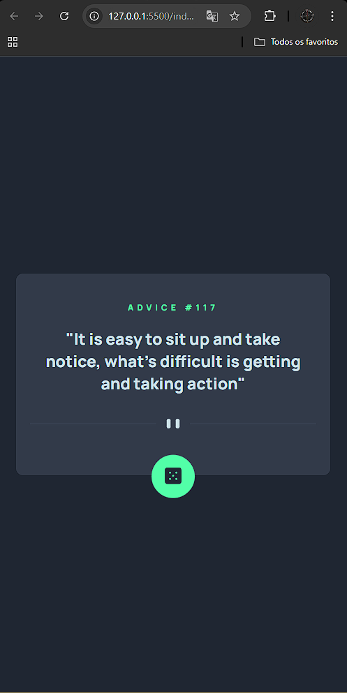

# Índice

- [Visão geral](#visão-geral)
- [O desafio](#o-desafio)
- [Captura de tela](#captura-de-tela)
- [Links](#links)
- [Construído com](#construído-com)
- [Autor](#autor)

## Visão geral

### O desafio

Recriar o layout do desafio proposto do app gerador de conselhos, a princípio somente a parte de HTML e CSS para posteriormente adicionar funções Javascript.

### Captura de tela

### Links

- URL da solução: [https://github.com/PietroZanetelliDev/exercicio-css-avancado-advice-generator-app-main](https://github.com/PietroZanetelliDev/exercicio-css-avancado-advice-generator-app-main)
- URL do site ativo: [Adicione o URL do site ativo aqui](https://your-live-site-url.com)

### Construído com

- Marcação HTML5 semântica
- Propriedades personalizadas CSS
- Flexbox
- CSS Flex

## Autor
- GitHub - [PietroZanetelliDev](https://github.com/PietroZanetelliDev)
